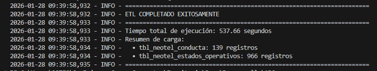
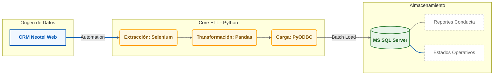

## Automatización ETL: Pipeline de CRM a MS SQL Server 
Este proyecto implementa una solución de Ingeniería de Datos de extremo a extremo para automatizar la extracción de reportes operativos  desde un CRM , transformando datos crudos en información estructurada y lista para análisis en Microsoft SQL Server.

<p align="center">
  
</p>

## El Problema de Negocio
Originalmente, la obtención de métricas de conducta y estados operativos de los agentes requería procesos manuales diarios: login en plataforma web, búsqueda y descarga de archivos individuales, limpieza manual y carga a base de datos. Este flujo era:

- **Ineficiente**: Consumía más de **3** horas de trabajo manual a la entrega de la información a operaciones **30 min** cada mañana.

- **Propenso a errores**: Alta variabilidad en los formatos de descarga y tipos de datos.

- **Limitado**: Dificultaba la creación de reportes e imposibilitaba el desarrollo de tableros de control en tiempo real.

## La Solución
Se desarrolló un pipeline robusto en Python que orquesta las tres fases del proceso ETL:

- **Extract (Selenium)**: Automatización del navegador en modo headless para navegar el CRM, manejar modales complejos y descargar reportes dinámicos de Infragistics.

- **Transform (Pandas)**: Normalización de nombres de columnas, conversión de formatos de tiempo (HH:MM:SS) a minutos decimales para análisis estadístico y limpieza de tipos de datos.

- **Load (PyODBC)**: Carga incremental y segura en SQL Server, utilizando transacciones y validaciones de seguridad para garantizar la integridad de los datos.



## Stack Tecnológico
- **Lenguaje**: Python 3.x

- **Automatización Web**: Selenium WebDriver (Headless Chrome)

- **Procesamiento de Datos**: Pandas

- **Base de Datos**: Microsoft SQL Server (PyODBC)

- **Resiliencia**: Tenacity (Retry logic)

- **Seguridad**: Python-dotenv (Gestión de secretos)

## Características especiales
A diferencia de un script básico, este ETL incluye:

- **Resiliencia ante fallos**: Implementación de decoradores @retry con espera exponencial para manejar inestabilidades de red o del CRM.

- **Seguridad y Sanitización**: Validación de whitelists para nombres de tablas y uso de variables de entorno para evitar la exposición de credenciales.

- **Optimización de Carga**: Uso de fast_executemany y carga por lotes (batching) para mejorar el rendimiento de inserción en SQL.

- **Mantenibilidad**: Logs detallados y manejo de excepciones con capturas de pantalla automáticas en caso de error en la fase de extracción.

## 📂 Configuración del Proyecto
### Requisitos Previos
- Tener instalado el **ODBC Driver 17 para SQL Server**.

- Un archivo **.env** en la raíz con la siguiente estructura:
  ```
  CRM_USER=tu_usuario\
  CRM_PASS=tu_contrasena\
  SQL_SERVER=nombre_del_servidor\
  SQL_DATABASE=nombre_de_la_bd\
  SQL_USER=usuario_sql\
  SQL_PASSWORD=pass_sql

### Instalación
```bash
git clone https://github.com/tu-usuario/etl-crm-sql.git
cd etl-crm-sql
pip install -r requirements.txt
python main.py
```
## Impacto Esperado
**Ahorro de tiempo**: Reducción del **100%** en la intervención manual para la carga de datos.

**Integridad**: Eliminación de duplicados mediante la limpieza de registros previos por fecha antes de la inserción.

**Disponibilidad**: Datos listos para ser consumidos por herramientas de BI a primera hora del día.

## Desarrollado por: 
**José Francisco Yudico Martínez** Profesional Interdisciplinario en Ciencia y Análisis de Datos.
